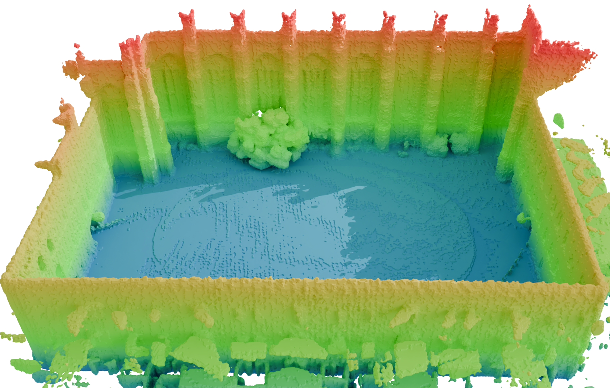

<a id="readme-top"></a>
<!-- PROJECT LOGO -->
<br />
<div>

# DLO: 3D Direct LIDAR Odometry based on Fast Truncated Distance Field

A Direct LIDAR Odometry (DLO) able to deal with raw 3D LIDAR data online, avoiding the need of LIDAR feature selection and tracking, simplifying the odometry pipeline and easily generalising to all types of scenarios. The method is based on the use of Fast Truncated Distance Field (Fast-TDF) as a convenient tool to represent the environment, enabling solving the LIDAR point-cloud registration as a nonlinear optimisation process without the need for selecting/tracking LIDAR features in the input data and updating the environment map at constant time independently of the size of the map itself.
<p align="center">
  
  
</p>

## 1. Prerequisites

Before you begin, make sure you have ROS 2 Humble and Ubuntu 24.04 (or higher) installed on your system. These are the core requirements for the project to run smoothly. If you haven't installed ROS 2 Humble yet, follow the official [installation guide](https://docs.ros.org/en/humble/Installation.html) for your platform. This guide will walk you through all the necessary steps to set up the core ROS 2 environment on your system. 


### Required ROS2 Packages

In addition to the basic ROS2 installation, the following packages are needed for this project. These are typically included in a standard ROS2 setup, but it's always good to check if they are present on your system:

- `tf2_eigen`
- `pcl_conversions`
- `pcl_ros`
- `tf2_ros`
- `tf2_geometry_msgs`
- `message_filters`
- `sensor_msgs`
- `geometry_msgs`
- `nav_msgs`
- `pcl_ros`

If any of these packages are missing, you can install them using the following command:
```bash
sudo apt install ros-humble-tf2-eigen ros-humble-pcl-conversions ros-humble-pcl-ros ros-humble-tf2-ros ros-humble-tf2-geometry-msgs ros-humble-message-filters ros-humble-sensor-msgs ros-humble-geometry-msgs ros-humble-nav-msgs
```
### Install External Libraries

Besides the ROS2 packages, this project depends on several external libraries that you may need to install manually. These libraries include **Eigen3** for linear algebra operations, **Ceres Solver** for optimization, **PCL (Point Cloud Library)** for point cloud processing, and **OpenCV** for image and matrix operations.

- `PCL` (Common, Filters components)
- `Boost` (Thread, Chrono components)
- `glog`
- `Ceres`
- `OpenMP`
- `Eigen3`
- `std_srvs`
- `ANN_LIB` (Approximate Nearest Neighbor library)

To install these external libraries, simply copy and run the following command in your terminal:
```bash
sudo apt install libpcl-dev libboost-thread-dev libboost-chrono-dev libglog-dev libceres-dev libopenmp-dev libeigen3-dev ros-humble-std-srvs libann-dev || true
```
**# Install All Dependencies Automatically**

For convenience, you can install all dependencies by running the following command **inside the package folder**:
```bash
rosdep install --from-paths src --ignore-src -r -y
```

## 2. Installation


To install and build the project, simply clone the repository as follows:

   ```bash
   git clone https://github.com/robotics-upo/dlo3d.git
   cd ..
   colcon build
   source install/setup.bash
```

## 3. Running the Code
The code can be launched automatically using one of the available launch files. There is a generic launch file, **dlo3d_launch.py**, which serves as a template for adapting the configuration to the specific dataset. Additionally, there are two predefined launch files tailored for the VIRAL and College datasets.

To launch the code, use the following example command:
  ```bash
ros2 launch dlo3d dlo3d_launch.py
```
This command will start the node and prepare it to receive information via the topics. The node will remain in a waiting state until data is published. If you wish to additionally launch a pre-recorded bag file, you can specify the bag_path parameter as shown below:


  ```bash
ros2 launch dlo3d dlo3d_launch.py bag_path:='bag_path/bag.db3
```
Along with the node and bag file, RViz visualization will also be launched to display a 3D representation of the environmen

**3.1 Node Configuration Parameters**

The dlo3d_node requires a series of configuration parameters to operate correctly, which are related to the dataset and the vehicle being used. These parameters are as follows:

Point Cloud Parameters:
- **in_cloud_aux**
- **in_cloud**
- **hz_cloud**
- **aux_lidar_en**
- **min_range**
- **max_range**
- **pc_downsampling**

IMU Parameters:
- **in_imu**
- **hz_imu**
- **calibration_time**
- **gyr_dev**
- **gyr_rw_dev**
- **acc_dev**
- **acc_rw_dev**

Frames Id
- **base_frame_id**
- **odom_frame_id**
- **map_frame_id**

KeyFrame Treshold Parameters:
- **keyframe_dist**
- **keyframe_rot**

Grid and Map Parameters:
- **tdfGridSizeX_low**
- **tdfGridSizeX_high**
- **tdfGridSizeY_low**
- **tdfGridSizeY_high**
- **tdfGridSizeZ_low**
- **tdfGridSizeZ_high**

Solver and Performance Parameters:
- **solver_max_iter**
- **solver_max_threads**
- **robust_kernel_scale**

These parameters allow you to fine-tune the node’s behavior, including settings related to the input cloud topics, IMU data, grid size, calibration, and solver configurations, among others.

## 3. Output Data and Services
When the code is launched, it automatically stores a CSV file containing the odometric pose information every time an optimization occurs, synchronized to the LiDAR frequency. 

 **[timestap, x, y, z, q_x, q_y, q_z, q_w, vx, vy, vz, gxf, gyf, gzf, gbx, gby, gbz, abx, aby, abz]**

Additionally, a file named times_dlo.csv is generated, which records the runtime information for the code.

 **[total_time, optimized, opt_time, updated, update_time]**


The node also provides two services for saving the grid data to a file. These services execute the process in a parallel thread:

- **save_grid_csv**: Saves the grid in CSV format.

- **save_grid_pcd**: Saves the grid in PCD format.

You can call these services directly using the following commands in ROS 2:


  ```bash
ros2 service call /save_grid_csv std_srvs/srv/Empty

ros2 service call /save_grid_pcd std_srvs/srv/Empty
```