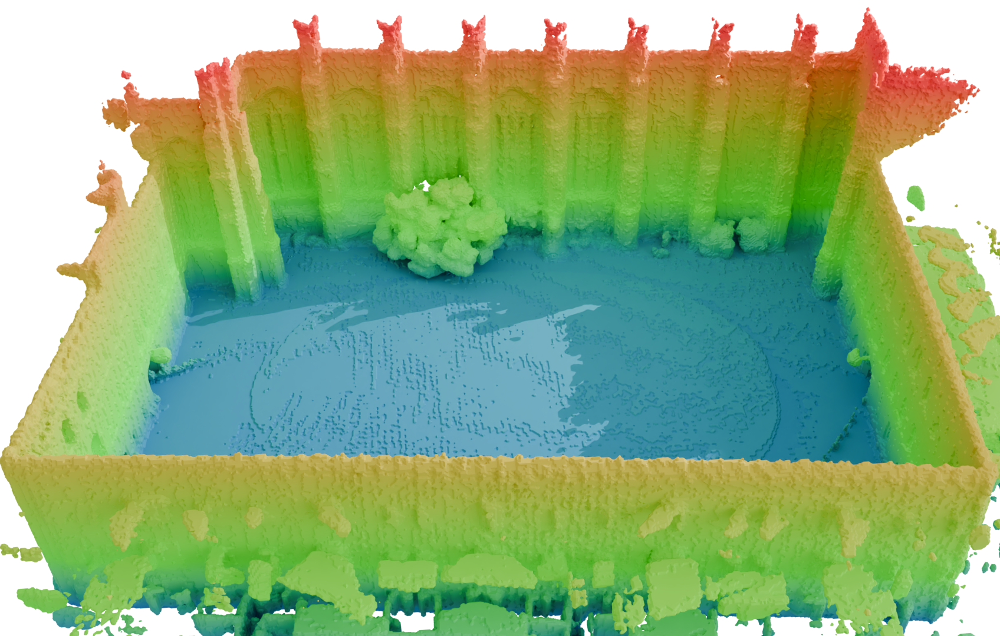
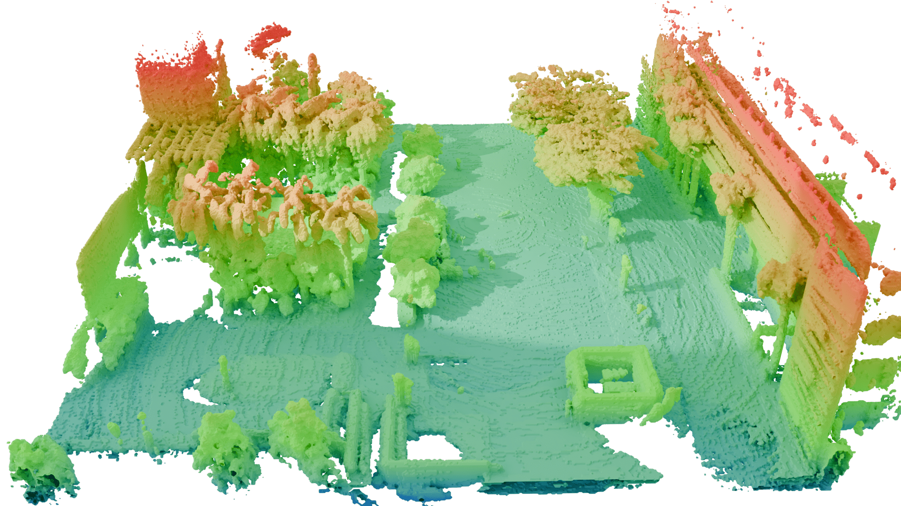

<a id="readme-top"></a>
<!-- PROJECT LOGO -->
<br />

> [!NOTE]  
> 🎉 **D-LIO** has been accepted to **IEEE Robotics and Automation Letters (RA-L)**! 🎉


# D-LIO: 6DoF Direct LiDAR-Inertial Odometry based on Simultaneous Truncated Distance Field Mapping

<p align="center">
<strong> 🤖 <a href="https://robotics-upo.github.io/D-LIO/">Visit the project website</a> 🤖 </strong>
</p>

<div align="center">
  <a href="https://youtu.be/HmrA9YOCZ9w"></a>
  <a href="https://arxiv.org/abs/2505.16726"></a>
</div>


A Direct LIDAR Inertial Odometry (D-LIO) able to deal with raw 3D LIDAR data online, avoiding the need of LIDAR feature selection and tracking, simplifying the odometry pipeline and easily generalising to all types of scenarios. The method is based on the use of Fast Truncated Distance Field (Fast-TDF) as a convenient tool to represent the environment, enabling solving the LIDAR point-cloud registration as a nonlinear optimisation process without the need for selecting/tracking LIDAR features in the input data and updating the environment map at constant time independently of the size of the map itself.
<p>
  
  
</p>


<div align="center">
  <h3>🎉 D-LIO has been accepted to IEEE Robotics and Automation Letters (RA-L)! 🎉</h3>
</div>

<details>
  <summary>Index</summary>

- [1. Prerequisites](#1-prerequisites)
- [2. Installation](#2-installation)
  - [2.1 Install Locally](#21-install-locally)
  - [2.2 Install Using Docker](#22-install-using-docker)
- [3. Running the Code](#3-running-the-code)
  - [3.1 Node Configuration Parameters](#31-node-configuration-parameters)
- [4. Output Data and Services](#4-output-data-and-services)
</details>


## 1. Prerequisites

Before you begin, make sure you have ROS 2 Humble and Ubuntu 24.04 (or higher) installed on your system. These are the core requirements for the project to run smoothly. If you haven't installed ROS 2 Humble yet, follow the official [installation guide](https://docs.ros.org/en/humble/Installation.html) for your platform. This guide will walk you through all the necessary steps to set up the core ROS 2 environment on your system. 


### Required ROS2 Packages

In addition to the basic ROS2 installation, the following packages are needed for this project. These are typically included in a standard ROS2 setup, but it's always good to check if they are present on your system:

- `ros-humble-tf2-ros`
- `ros-humble-tf2-eigen`
- `ros-humble-pcl-conversions`
- `ros-humble-pcl-ros`
- `ros-humble-message-filters`
- `ros-humble-geometry-msgs`
- `ros-humble-nav-msgs`
- `ros-humble-sensor-msgs`
- `ros-humble-std-srvs`

### Install External Libraries

Besides the ROS2 packages, this project depends on several external libraries that you may need to install manually. 

- **PCL** (`libpcl-dev`)
- **Boost** (`libboost-all-dev`)
- **OpenMP** (`libomp-dev`)
- **Eigen3** (`libeigen3-dev`)
- **Ceres Solver** ≥ 2.1.0 (built from source to support `QuaternionManifold`)
- **ANN** (Approximate Nearest Neighbor library from `dials/annlib`)
- **YAML-CPP** (`libyaml-cpp-dev`)
- **GFlags / GLog / SuiteSparse / ATLAS** (dependencies for Ceres)

> If installing locally, make sure to build **Ceres Solver from source** with version `>= 2.1.0`, as required by the D-LIO solver implementation.

## 2. Installation

### Install localy
To install and build the project, simply clone the repository as follows:

   ```bash
   git clone https://github.com/robotics-upo/dlo3d.git
   cd ..
   colcon build
   source install/setup.bash
```

### Install using Docker
Follow these steps to build and run D-LIO inside a Docker container:
1. Clone the repository:
    ```bash
    git clone https://github.com/robotics-upo/dlo3d.git
    cd dlo3d
    ```

2. Build the Docker image:
    ```bash
    docker build -t dlio_ros2:humble .
    ```

3. Allow Docker to access the X server (for GUI like RViz):
    ```bash
    xhost +local:docker
    ```

4. Run the container
    ```bash
    docker run -it \
      --env="DISPLAY" \
      --env="QT_X11_NO_MITSHM=1" \
      --volume="/tmp/.X11-unix:/tmp/.X11-unix:rw" \
      --name dlio_container \
      dlio_ros2:humble
    ```
The Dockerfile sets up the entire environment and downloads the D-LIO code automatically.

## 3. Running the Code
The code can be launched automatically using one of the available launch files. There is a generic launch file, **dlo3d_launch.py**, which serves as a template for adapting the configuration to the specific dataset. Additionally, there are two predefined launch files tailored for the VIRAL and College datasets.

To launch the code, use the following example command:
  ```bash
ros2 launch dlo3d dlo3d_launch.py
```
This command will start the node and prepare it to receive information via the topics. The node will remain in a waiting state until data is published. If you wish to additionally launch a pre-recorded bag file, you can specify the bag_path parameter as shown below:


  ```bash
ros2 launch dlo3d dlo3d_launch.py bag_path:='bag_path/bag.db3
```
Along with the node and bag file, RViz visualization will also be launched to display a 3D representation of the environmen

**3.1 Node Configuration Parameters**

The dlo3d_node requires a series of configuration parameters to operate correctly, which are related to the dataset and the vehicle being used. These parameters are as follows:

* Point Cloud Parameters:
    - **in_cloud_aux**
    - **in_cloud**
    - **hz_cloud**
    - **aux_lidar_en**
    - **min_range**
    - **max_range**
    - **pc_downsampling**

* IMU Parameters:
    - **in_imu**
    - **hz_imu**
    - **calibration_time**
    - **gyr_dev**
    - **gyr_rw_dev**
    - **acc_dev**
    - **acc_rw_dev**

* Frames Id
    - **base_frame_id**
    - **odom_frame_id**
    - **map_frame_id**

* KeyFrame Treshold Parameters:
    - **keyframe_dist**
    - **keyframe_rot**

* Grid and Map Parameters:
    - **tdfGridSizeX_low**
    - **tdfGridSizeX_high**
    - **tdfGridSizeY_low**
    - **tdfGridSizeY_high**
    - **tdfGridSizeZ_low**
    - **tdfGridSizeZ_high**

* Solver and Performance Parameters:
    - **solver_max_iter**
    - **solver_max_threads**
    - **robust_kernel_scale**

These parameters allow you to fine-tune the node’s behavior, including settings related to the input cloud topics, IMU data, grid size, calibration, and solver configurations, among others.

## 3. Output Data and Services
When the code is launched, it automatically stores a CSV file containing the odometric pose information every time an optimization occurs, synchronized to the LiDAR frequency. 

 **[timestap, x, y, z, q_x, q_y, q_z, q_w, vx, vy, vz, gxf, gyf, gzf, gbx, gby, gbz, abx, aby, abz]**

Additionally, a file named times_dlo.csv is generated, which records the runtime information for the code.

 **[total_time, optimized, opt_time, updated, update_time]**


The node also provides two services for saving the grid data to a file. These services execute the process in a parallel thread:

- **save_grid_csv**: Saves the grid in CSV format.

- **save_grid_pcd**: Saves the grid in PCD format.

You can call these services directly using the following commands in ROS 2:


  ```bash
ros2 service call /save_grid_csv std_srvs/srv/Trigger

ros2 service call /save_grid_pcd std_srvs/srv/Trigger
```

## Citation

If you use D-LIO in your research, please cite our paper:

```bibtex
@article{cotoelena2025dlio,
  title   = {D-LIO: 6DoF Direct LiDAR-Inertial Odometry based on Simultaneous Truncated Distance Field Mapping}, 
  author  = {Lucia Coto-Elena and J. E. Maese and L. Merino and F. Caballero},
  journal = {IEEE Robotics and Automation Letters (RA-L)},
  year    = {2025},
  note    = {Accepted for publication. To appear.},
  eprint  = {2505.16726},
  archivePrefix = {arXiv},
  url     = {[https://arxiv.org/abs/2505.16726](https://arxiv.org/abs/2505.16726)}
}
```

## 4. Acknowledgments
This work is partially supported by the grants INSERTION (PID2021- 127648OB-C31) and NORDIC (TED2021-132476B-I00), both funded by the “Agencia Estatal de Investigación – Ministerio de Ciencia, Innovación y Universidades” and the “European Union NextGenerationEU/PRTR.

<p align="center">
  
</p>


<p align="right"><a href="#readme-top">⬆ Back to top</a></p> 
